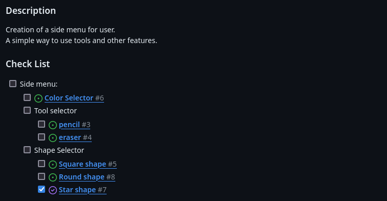

# Project-Management-Workshop

We encourage you to participate in this workshop with a partner.

We'll be initiating a new GitHub repository for the MyPaint project. Please discuss with your partner how to break down the project into manageable tasks.

For instance, here’s a suggested way to structure the tasks for the side menu:
- Side menu:
	- Color Picker
	- Tool selector
		- pencil tool
		- eraser tool
      - ...
	- Shape Selector
		- Square shape
		- Round shape
		- Star shape
      - ... 

## Part 1 - Github Project Basic
### Issues
*Issues are usefull for track tasks, features, bugs in the project.
It's important to **well define issues** to avoid any overlaps between issues.*

- Create an simple issue "Setup Repo" with a simple description.

-------------
### To do list
*Github Project help you **organize yourself and your team**.
For exemple, with the to-do list, you know the progress of your project and it's makes satisfaction to do a task.*

#### Step 1:
Create a project Paint (with the to-do list template) link to your repo.
*Don't forget permissions for your team mate.*


#### Step 2:
Think with your partner how to break down MyPaint into manageable tasks.
*All this step can be make in make in the Github Project*

- add the "Setup Repo" inside.
- create all MyPaint issues.

-------------
## Part 2 - Github Project Advanced
*To well define issues and organize in the time, you can detail.
If you don't remember what do you do in the issue, you can retreive your note.
And complete check list in time.*

- add check list in each issue and detailed description *(you can create issues in issues for some big task)*

- add a planning
- create tag and attribute corresponding tag to issues (like sfml, drawing, tools, ...)
- create a milstone (Must, Should, Could) to see progress in the project
-------------
## Part 3 -  Github Project Expert
### Branch 
=======

In Git, branches are essentially divergent copies of the same project, which allow you to isolate development work without affecting the main line of the project (often called `main` or `master`). This isolation makes it easier to manage features, fix bugs, or experiment with new ideas in a contained area of the repository.

#### Step 1:
**Create a Branch from an Issue:**
This practice links your work directly to the issue tracker. When you create a branch for an issue, any pull request from this branch that gets merged can automatically close the issue, assuming it's linked properly.

#### Step 2:
**Push a File:**
Once your branch is set up, add a simple file named hello_world.txt with the content "Hello pull request World!" and push this to your branch.

So now have our branch created from an issue. So whenever you create a pull request this branch and afterward close it it will automatically close the issue. If this issue is linked to a well setup github project it will also automaticaly place the task into the `Done` category.

-------------

### Pull request 

Pull requests allow you to inform others about the changes you've pushed to a branch in a repository on GitHub. By opening a pull request, you are proposing your changes and requesting that someone review and pull in your contribution and merge them into their branch. Pull requests show diffs, or differences, of the content from both branches. The changes, additions, and subtractions are shown in green and red.

As such, pull requests are not only a means to initiate code review but also a platform for collaborative discussion about the changes before they are integrated into the main project.

#### Step 1:
**Create a Pull Request:**
Start the integration process by creating a pull request for your hello_world.txt file to merge it into the main branch.
#### Step 2:
**Assign a Reviewer:**
Select a team member to review your pull request. This encourages peer feedback and ensures quality control.
#### Step 3:
**Review and Request Changes:**
Actively participate in reviewing a colleague’s pull request. If necessary, request specific improvements or corrections.
#### Step 4:
**Make Corrections:**
If your pull request receives comments requesting changes, update your branch accordingly. This may involve modifying code or adding new information.
#### Step 5:
**Approve a Pull Request:**
After reviewing a corrected pull request from a peer, if the updates meet the project standards, approve the pull request


-------------
## Part 4 - Github Project Bonus
###  Webhook with Discord

A discord webhook will help you being notify of the changes on a repository.
Let's setup this **discord webhook** to tell you when one of these events happenned on your github repository:
```
Issue events
Milestones events
Pull Request events
Push events
Workflow events
Forks events
Branch events
```

Step by step:
1. Get the webhook URL from Github
2. Make a discord server
3. Make a discord webhook

## Going Further

There's a lot of tool to organize your team available, don't hesitate to try them and pick the one you like the most.
Here are some known service: Linear, Jira, Slack, Trello etc...
